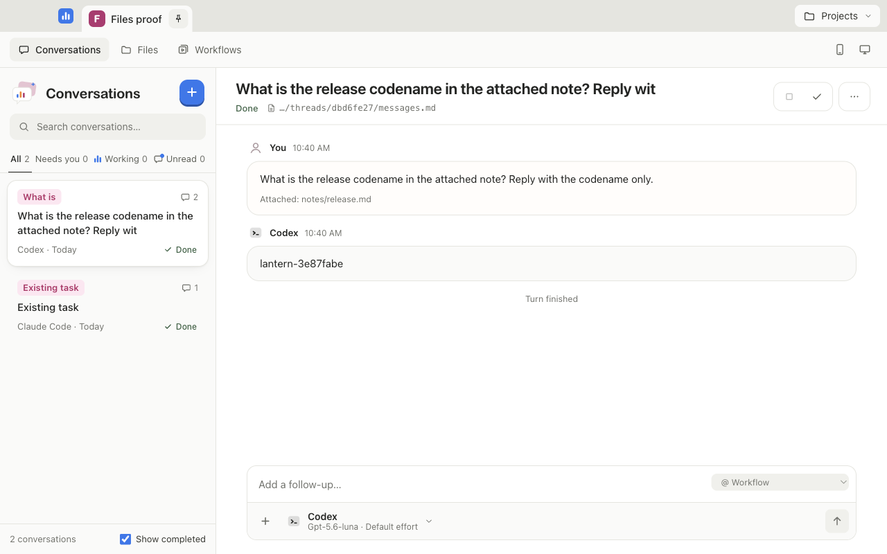
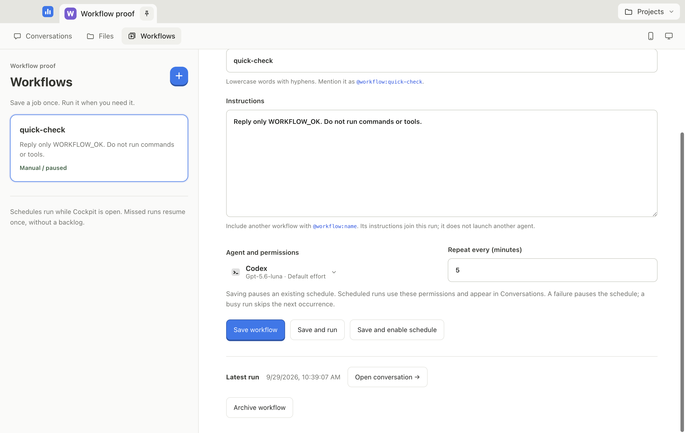

# Cockpit

**A desktop cockpit for the coding agents you already pay for.** Run several Claude Code and Codex conversations side by side, see at a glance which ones are working and which ones need you, answer their approvals inline, and switch a conversation from one agent to the other when a usage limit hits. Agents can start your dev server, read its logs and open the preview on their own.

Cockpit does no AI inference itself. It drives the official `claude` and `codex` CLIs headless, so usage counts against your own subscriptions, and every conversation stays on your own disk as plain files.


## Desktop walkthrough

Fresh packaged-app captures from the September 29 inspection, using Codex Luna and synthetic projects. The primary demo flow is: open a project, ask the agent to start its dev server, approve, inspect the preview URL, then stop or restart it.

<details>
<summary>Approval, attached files, and repeatable workflows</summary>

**Approve the process start in the conversation.**


**Attach a project file and get an answer from its contents.**



**Save instructions and choose when they run.**



[File browser in dark mode](docs/proof/phase-5-files-dark.png) · [Workflow editor in dark mode](docs/proof/phase-5-workflows-dark.png) · [Process controls](docs/proof/phase-4-processes.png)

</details>

## Features

- **Parallel conversations, grouped by project.** A tab per pinned project, each showing how many agents are working and how many need you. The list filters by All, Needs you, Working and Unread, with live counts and search.
- **Approvals where you are.** When an agent asks to run a command or edit a file, the request appears as a card in the conversation: Allow, Allow for this session, or Deny.
- **Two agents, one thread.** Pick Claude Code or Codex, the model, effort and permission mode per conversation. Switch agent mid-thread and the transcript is handed over to the new one.
- **Dev servers the agent can see.** Every agent session gets a built-in `cockpit` MCP server. The agent starts long-running commands through it, reads their output, and opens the local preview for you. Running processes show under the conversation title, with the URL and a Stop button.
- **Repeatable workflows.** Save project instructions and agent settings, run them manually or on a repeating interval, and open each run as a conversation. Schedules run while Cockpit is open and pause on failure.
- **Project files in the conversation.** Browse and preview text files, then attach their current contents to a new or existing conversation draft.
- **Files first.** Each conversation is `meta.json`, `events.jsonl` and a readable `messages.md` under `~/.agent-cockpit/`. Agents send prompts to their providers. Optional phone access serves conversations over Tailscale; optional Web Push sends encrypted notification payloads through the browser's push provider.
- **Phone access.** Pair a phone through Tailscale to follow conversations, reply, approve requests and stop a turn. The notification bell enables alerts when an agent asks for approval.
- **A real Mac app.** Native window, runs from Finder or the Dock, and quitting stops every agent and dev server it started.

## Early release

Cockpit is an early, usable build for other builders to try and give feedback on. The current supported target is macOS on Apple silicon; remaining experiments and acceptance checks are listed below.

## Quick start

**Supported MVP:** macOS on Apple silicon. Windows, Linux and Intel Mac packages are not currently supported or verified.

Use your own [Claude Code](https://docs.anthropic.com/en/docs/claude-code) (`claude`) and/or [Codex](https://github.com/openai/codex) (`codex`) installation and account. You only need one of them. Open that CLI in a terminal, finish its sign-in and confirm it can answer a prompt before using Cockpit. Cockpit does not provide an AI account, transfer the developer's credentials, or bypass provider usage limits.

To build from source, install Node 22.12+ and Git:

```bash
git clone https://github.com/Holodeck23/agent-cockpit.git
cd agent-cockpit
npm install
node node_modules/electron/install.js   # Electron's binary, if your npm blocks install scripts
npm run doctor     # check this Mac's platform and installed CLIs; no agent usage

npm run app        # build and open the desktop app from the repo
```

To build and install the app:

```bash
npm run package
cp -R release/mac-arm64/Cockpit.app /Applications/
```

The build is ad-hoc signed, not notarized, so the first launch may need right-click, then Open.

Prefer a browser? `npm start` serves the same UI at http://127.0.0.1:4317.

### Your first conversation

1. Open Cockpit and choose **Open a project folder…**. Pick a folder on your own Mac.
2. In **Agent settings**, select the CLI you installed. Leave **Model** blank to use its configured default, or enter a model your account can access. Model access varies by provider and account.
3. Start with **Ask before acting**, then send a small request. Approval cards let you allow or deny proposed actions.

Every macOS user gets separate state under their own `~/.agent-cockpit/`. No project folders, paired phones, signing keys or accounts ship inside the app. Phone access starts off and is optional. Each user pairs their own devices on their own Tailscale account; the public repository address used as Web Push contact metadata is not a relay or an account dependency.

If a CLI cannot be found, run `npm run doctor` from the source checkout and restart Cockpit after installation. If an agent reports authentication, model-access or usage-limit errors, resolve them in that CLI/account or select your other installed agent.

## Use it from your phone

1. Install Tailscale on the Mac and phone, and sign in with the same account. On the Mac, allow Tailscale's network extension when macOS asks (System Settings, Login Items & Extensions, Network Extensions). In the Tailscale admin console, turn on MagicDNS and HTTPS certificates. Keep the Mac awake with Cockpit running.
2. In Cockpit on the Mac, open **Phone access** and choose **Turn on phone access**. If Tailscale needs setup, follow the error shown there.
3. Open the displayed HTTPS address on the phone, or scan its QR code. Choose **Ask my Mac**, compare the six-digit code on both screens, then **Allow** on the Mac.
4. On Android, Chrome can add Cockpit to the home screen. Open a conversation to reply, answer an approval, or stop it.
5. To try notifications, tap the bell on the phone and grant permission. In the Mac's Phone access panel, choose **Send a test notification**. Confirm that it appears on the phone. A push service accepting a message alone does not prove delivery.

Notifications contain the project and conversation title and can appear on the phone's lock screen. Tap the bell again to turn them off; removing a paired phone also removes its subscriptions. Phone access requires the Mac to be reachable over Tailscale. No public relay or Telegram bot is needed.

**Validation:** the packaged app is tested through real Tailscale with a phone-sized Chrome browser. Real push delivery to a physical phone remains a manual acceptance check; automated Chrome in this setup rejects push registration. The app reports agent usage-limit errors, and another configured agent can be selected when one provider is capped.

## How it works

```
Cockpit window (React) ──HTTP + SSE──►  local server (Node, 127.0.0.1, random port)
                                         ├─ claude -p          stream-json over stdio, approvals over stdio
                                         ├─ codex app-server   JSON-RPC over stdio
                                         ├─ process runner     dev servers, one process group each
                                         └─ ~/.agent-cockpit/  threads as plain files
         each agent session ──stdio──►  cockpit MCP server ──HTTP + session token──► local server
```

- **Adapters** turn each CLI's wire protocol into one event model, so threads, storage and UI never care which agent is talking.
- **Nothing raw reaches a command line.** Every flag passed to a CLI is built from a schema allowlist.
- **The server only answers its own page.** Loopback host, matching origin and JSON-only writes, so a website open in your browser can't drive your agents.
- **The desktop app is the same server** in Electron's main process, with a sandboxed page and no Node in the renderer.

More in [docs/ARCHITECTURE.md](docs/ARCHITECTURE.md). The CLI protocol details that took testing to find are in [docs/PROTOCOLS.md](docs/PROTOCOLS.md), and the build history, phase by phase with what and why, is in [docs/BUILD-NOTES.md](docs/BUILD-NOTES.md).

## The cockpit MCP

| Tool | What it does | Asks first |
|---|---|---|
| `start_process` | Runs a command such as `npm run dev` in the project and waits for its URL or first output | Yes |
| `stop_process` | Stops it and everything it spawned | Yes |
| `list_processes` | The project's processes, status and URL | No |
| `read_process_output` | The log, incrementally | No |
| `open_preview` | Opens a local page (localhost only) for you | No |
| `save_workflow` | Saves reusable instructions in the current project, with scheduling off | Yes |

Each session's tools are scoped to that session's project by a token that ends with the session. The token is passed through the agent's environment, never on a command line.

## Workflows and files

Open **Workflows** to save instructions, choose an agent and permissions, and run the job. To repeat it, set an interval (5 minutes to 30 days) and choose **Save and enable schedule**. Saving edits pauses the schedule. Runs already working or waiting for approval are skipped; after downtime, at most one missed run is started. Cockpit must remain open for schedules to run.

Use `@workflow:daily-review` to include another saved workflow's instructions in the same turn. References stay within the project and cycles are rejected. This combines instructions; it does not create separate dependent agent jobs.

Open **Files**, or use the composer's attachment button, to preview a text file and add it to your draft. `@file:src%2Fhello%20world.ts` is an encoded relative path; the picker handles encoding. Files are read again when sent, including during scheduled workflow runs. Text files are limited to 100 KB each, eight attachments and 200,000 characters per expanded prompt. The conversation keeps your message as written, with each attachment shown by name; the file contents go to the agent only. A reference counts only at the start of a word, so an address like `a@file:x` is sent as plain text. A missing or badly encoded file stops the send with a short message and keeps your draft.

## Development

| Command | What it does |
|---|---|
| `npm run doctor` | Check the supported platform and discover installed agent CLIs and optional Tailscale; does not test account authentication |
| `npm run verify` | Typecheck, unit tests, web and Electron builds |
| `npm start` | Serve the UI at http://127.0.0.1:4317 |
| `npm run app` | Build and open the desktop app from the repo |
| `npm run package` | Build `release/mac-arm64/Cockpit.app` and a `.dmg` |
| `npm run smoke:claude` / `smoke:codex` | Real two-turn run that resumes across processes |
| `npm run smoke:mcp [claude\|codex]` | Real agent, dev-server task: must use the cockpit tools on its own |
| `npm run proof:app` | Packaged app from a bare Finder PATH: a Haiku thread to Done, quit mid-turn, no agent left running |
| `tsx scripts/proof-b.ts b1\|b2\|b3` | Packaged app UI gates with screenshots |
| `npm run proof:reliability` | Packaged app with synthetic threads: delayed loads, message routing, completion and reopening; no agent usage |
| `npm run proof:workflows` | Packaged app: real Codex manual and scheduled workflow runs, editor and schedule controls |
| `npm run proof:files` | Packaged app: file browsing, draft preservation and a real Haiku attachment check |
| `npm run proof:mcp` | Packaged app: agent starts, reads and previews the dev server unprompted; Stop, restart, clean quit |
| `npm run proof:phone` | Packaged app and real Tailscale on HTTPS 8443: turn on phone access, pair a phone-sized Chrome, and refusals for a login not on the allowlist, the LAN address, no identity, a foreign Origin, an unpaired and a removed phone, each with a control |
| `npm run proof:phone -- --live` | Also run one real Codex workflow-save approval, answer it through the phone view, and verify the result arrives live; uses the configured small Codex model |

Use `npm run proof:files -- --codex` and `npm run proof:mcp -- --codex` to run the packaged file/process checks with Codex instead of Claude. Set `COCKPIT_CODEX_MODEL` to choose an available model.

Some proofs and smokes call real agents and consume your provider allowance. Codex proofs default to the model used for development; set `COCKPIT_CODEX_MODEL` to a model available to your account before running them. The product itself uses your CLI's default when Model is blank. Screenshots land in [docs/proof/](docs/proof/).

## Status and roadmap

Built and proven: Claude and Codex adapters, parallel threads, approvals, stop, agent switching with handoff, the desktop app, the full conversation UI, the cockpit MCP with the process runner, workflows and schedules, file attachments, and phone access over Tailscale with pairing and a phone layout.

Next:
1. **Primary release flow.** Walk it on a fresh setup: open a project with the folder picker, ask the agent to run its dev server and check the log, allow the start, open the preview in a real browser, then stop or restart the server.
2. **Phone acceptance.** Web Push is implemented; confirm notification delivery and tapping on a physical phone.
3. **Preview pane.** `open_preview` opens inside the app, and the agent can check its own UI change with a screenshot.

## Credits

The layout and interaction model are inspired by [Enjoy](https://enjoy.dev), a commercial desktop app for coding agents. Cockpit's name, mark, illustrations, copy and code are its own. No code or assets were taken from Enjoy.
