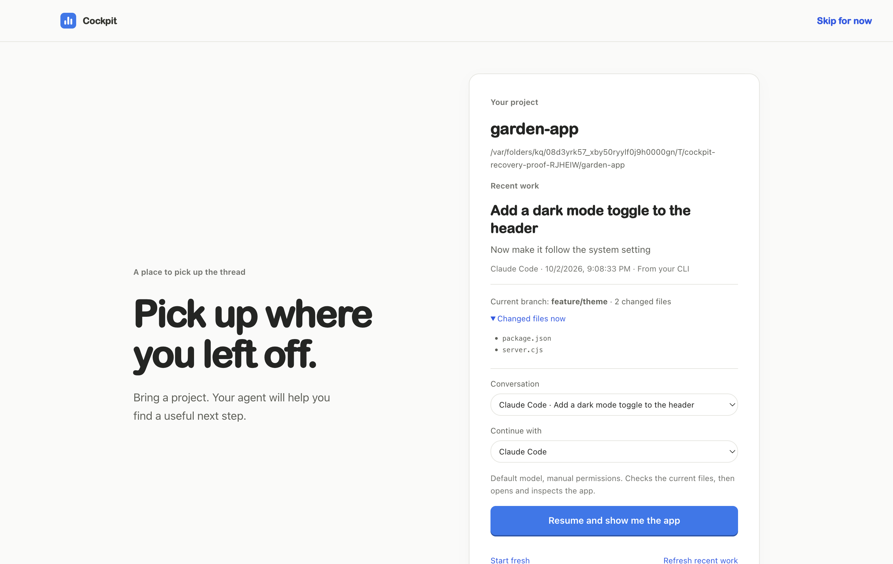
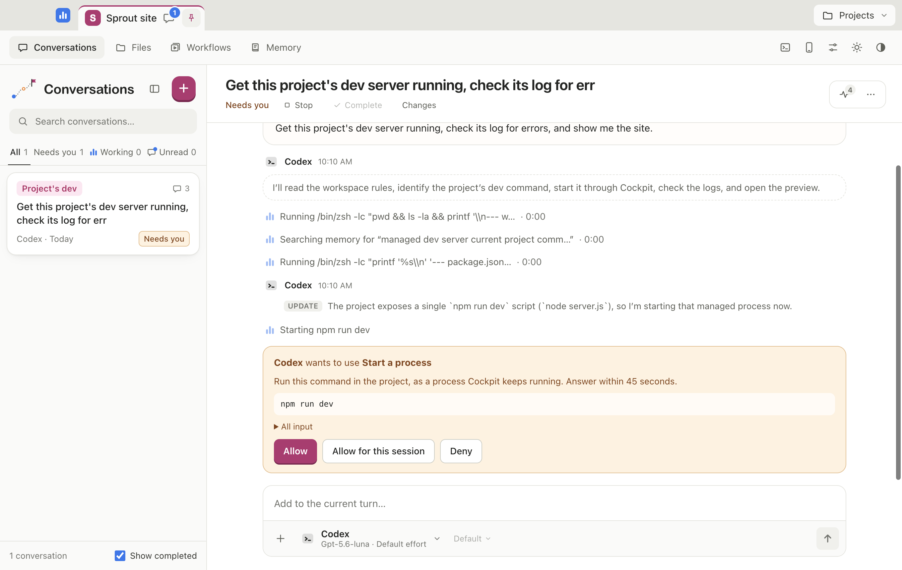
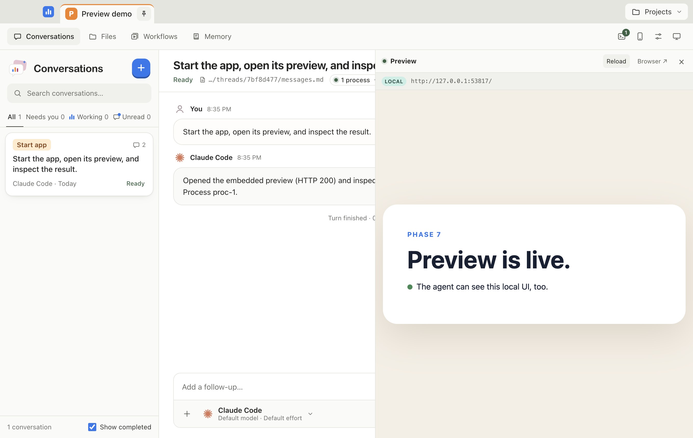

# Agent Cockpit

Cockpit is a macOS desktop app that runs installed coding-agent CLIs using your existing subscriptions or provider setup. Supported agents include Claude Code, Codex, Google Antigravity, and OpenCode (OpenRouter is accessed through OpenCode).

> **v0.1.5 prerelease · 2026-10-07:** Everything built since v0.1.4 in one release. The agent picker now shows what each CLI really supports, and can install, update and sign in to Claude Code, Codex and Antigravity for you, using each vendor's official installer. Updates wait until that agent's conversations are idle. Also new: a changes viewer, processes and previews that belong to their conversation, an in-app browser page per conversation that the agent can use with your approval, image attachments, richer replies and workflows. Not notarized; Apple-silicon Macs only.

## Pick up where you left off

Open a project and Cockpit finds recent Cockpit, Claude Code and Codex conversations. See the latest task, agent, current branch and changed files, then choose **Resume and show me the app**. Your agent resumes the work, asks to start the server if needed, and opens and inspects the embedded preview. You can choose another conversation or agent, start fresh, or explore a project with no recent session.



Three automated runs with fresh Cockpit state and real Claude sessions reached an inspected sample app in 19.9–22.9 seconds. This used an already signed-in CLI and a prepared dependency-free project; it is not a promise about a first installation or every project.

## Supported Platforms

Currently, Cockpit is built for macOS and Apple Silicon (ARM64). It expects the supported Agent CLIs to be installed on your system.

## Quick Links

- [Installation and Updating Guide](docs/user/index.md)
- [First-Run Quick Start](docs/user/quickstart.md)
- [User Guide](docs/user/guide.md)
- [Agent Compatibility and Limitations](docs/user/compatibility.md)
- [Troubleshooting](docs/user/troubleshooting.md)
- [Developer Guide](docs/user/developer.md)

## Install

Paste this into Terminal on an Apple Silicon Mac:

```sh
curl -fsSL https://raw.githubusercontent.com/Holodeck23/agent-cockpit/main/install.sh | sh
```

It downloads the newest release, checks it against the release's `SHA256SUMS`, and puts Cockpit in Applications. Installed this way, Cockpit opens on the first try, with no Gatekeeper block ([what it does](install.sh)). Run the same line again to update, after quitting Cockpit.

## Download

Releases are also provided as `.dmg` packages for Apple Silicon Macs. You can find the latest [`Cockpit-0.1.5-arm64.dmg`](https://github.com/Holodeck23/agent-cockpit/releases/download/v0.1.5/Cockpit-0.1.5-arm64.dmg) in the [Releases page](https://github.com/Holodeck23/agent-cockpit/releases).

> **Note**: Cockpit is currently distributed without Apple notarization. On the first launch, macOS Gatekeeper will block the app and display "**Cockpit** Not Opened".
> Do not choose "Move to Trash". Instead, click **Done**, go to **System Settings > Privacy & Security**, scroll down, and click **Open Anyway**.
>
> Alternatively, you can run `xattr -dr com.apple.quarantine /Applications/Cockpit.app` in your terminal to allow the app to launch.

**Updating:** v0.1.3 and later include **Cockpit → Check for Updates…**. It shows the newest release and its notes. From the next release, **Copy Install Command** copies the install line above for Terminal; before that, **Download Update** opens the official DMG in your browser. To install, finish or stop running agents, quit Cockpit and drag the new app to Applications; your conversations and settings are kept. Nothing is installed or restarted automatically. v0.1.2 and earlier need one manual download of the first build that has this menu item.

See the [release notes](https://github.com/Holodeck23/agent-cockpit/releases/tag/v0.1.5) and [first-tester checklist](docs/user/tester-checklist.md). CLI detection does not verify sign-in or quota. Keep your agent CLI current: an older Codex CLI may reject a newer default model before the task starts.

## How it works

```
Cockpit window (React) ──HTTP + SSE──►  local server (Node, 127.0.0.1, random port)
                                         ├─ claude -p          stream-json over stdio, approvals over stdio
                                         ├─ codex app-server   JSON-RPC over stdio
                                         ├─ agy                stream-json over stdio, subscription credentials
                                         ├─ opencode acp       Agent Client Protocol over stdio
                                         ├─ process runner     dev servers, one process group each
                                         └─ ~/.agent-cockpit/  threads as plain files
         each agent session ──stdio──►  cockpit MCP server ──HTTP + session token──► local server
```

- **Adapters** turn each CLI's wire protocol into one event model, so threads, storage and UI never care which agent is talking.
- **CLI settings are validated.** Agent tools and approved process commands can still execute shell commands with your account permissions.
- **Local UI requests are checked.** Cockpit checks host, origin and JSON writes, and in the desktop app only the Cockpit window holds the per-launch key the API requires, so other programs on the Mac cannot drive it. MCP uses session tokens; optional phone access uses pairing and a separate authenticated listener.
- **Cockpit itself approves what agents change through it.** Starting processes, saving memory or workflows and controlling other conversations ask on Cockpit's own card, however the agent calls them.
- **The desktop app is the same server** in Electron's main process, with a sandboxed page and no Node in the renderer.

## Screenshots

- **Approval Prompts:**
  
- **Local Previews:**
  

## Licence

Cockpit is not open source. The code is published to be read; copying, modifying or redistributing it needs written permission. You may run the official builds from the Releases page for your own use. See [LICENSE](LICENSE).
