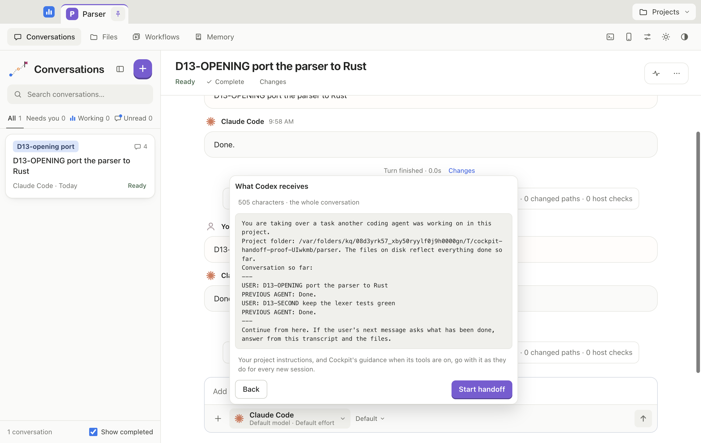

# User Guide

> **v0.1.5 prerelease (2026-10-07).** This guide describes `main`. Three things are not in the v0.1.5 download yet and are marked **in the next release**: the handoff review when you switch agents, phone live preview, and the main-process error log. See the [tester checklist](tester-checklist.md).

This guide covers what you can do in Cockpit, by task. For setup, start with [installation](index.md) and the [quick start](quickstart.md).

Contents: [Workspace and projects](#workspace-and-projects) · [Agents and settings](#agents-and-settings) · [Switching agents](#switching-agents) · [Agent CLIs from the picker](#agent-clis-from-the-picker) · [Conversations](#conversations) · [Changes and results](#changes-and-results) · [Files and your documents](#files-and-your-documents) · [Git](#git-and-branches) · [Processes and previews](#processes-and-previews) · [The browser pane](#the-browser-pane) · [Workflows and schedules](#workflows-and-schedules) · [Memory and project instructions](#memory-and-project-instructions) · [Phone access](#phone-access) · [What agents can do through MCP](#what-agents-can-do-through-mcp) · [Appearance](#appearance-and-sounds) · [Updates and help](#updates-and-help) · [Data and privacy](#data-backup-and-privacy)

## Workspace and projects

-   **Projects menu.** The **Projects** button at the top right has **New project…** (asks for a name and a place in the standard macOS save panel, creates the folder and opens it, and never touches a folder that already has files), **Open folder…**, **<project name> settings…**, **Import conversations…** and the list of recent projects.
-   **Tabs.** Open projects are tabs along the top, in the order you pinned them. Use the pin on a tab (**Pin tab** or **Unpin tab**) to keep it. A tab shows how many conversations are working and how many need you.
-   **Sections.** Under the tabs: **Conversations**, **Files**, **Workflows** and **Memory**. The **Processes** button, **Phone access**, **Settings**, the light and dark toggle and **Appearance** sit at the right.
-   **Shortcuts.** ⌘1 to ⌘8 open the first eight tabs and ⌘9 the last one. ⌥⌘1 to ⌥⌘5 open Conversations, Files, Workflows, Memory and Processes. Hover a tab or section to see its shortcut.
-   **Window.** Cockpit reopens at the size and place you left it, if that place is still on a screen.
-   **Closing and quitting.** Closing the window keeps Cockpit and its running agents alive, as most Mac apps do. **Quit** (⌘Q or the app menu) always ends Cockpit: it stops every agent session and every process it started, then exits.
-   **Project settings.** **Projects → <project name> settings…** has the project's name, tab tint, picture, [project instructions](#memory-and-project-instructions), **Let agents manage workflows**, **Give Antigravity Cockpit's tools**, **Your documents folder**, **Website data** (desktop app), the folder, and **Remove from Cockpit…**. A tint also colours the tab, the send and primary buttons, the working and process badges, the Complete control and resize bars.
-   **Removing a project.** Hover it in the Projects menu and click the bin, or use **Remove from Cockpit…** in its settings. The folder and its conversations stay, and schedules in it are paused. Opening the folder again brings it back. Removing a project also ends any [phone previews](#phone-live-preview) for it.
-   **Pins in the navigation.** Pin a project file or one of Your documents (**⋯ → Pin to navigation**) and it appears beside the sections, so you can reopen it from anywhere.
-   **Import.** **Import conversations…** lists Claude Code and Codex sessions for the selected folder. The next message resumes the original CLI session. Recent work also appears when you open a project for the first time (see the quick start).

## Agents and settings

The agent picker is the button beside the message box. It shows the agent, model and effort. A one-click **Effort** button sits next to it. OpenCode has no effort setting.

-   **Agent, model, effort and permissions.** Pick one of Claude Code, Codex, Antigravity or OpenCode. Leave the model blank to use the CLI's own default. In a conversation, effort applies from your next message and the agent's session continues.
-   **Permissions.** The labels are **Ask before acting**, **Edit files without asking**, **Plan only, no changes**, **Auto**, **Never ask** and **Bypass all permissions**. Which ones an agent offers depends on the agent.
-   **Antigravity** starts on **Bypass permissions**, because it cannot pause for approval when Cockpit runs it. **Configured permissions (Antigravity settings)** follows Antigravity's own settings, where workspace edits proceed and commands that would need approval are denied. **Plan only, no changes** is read-only.
-   **Remembered per agent.** Switching agents in the picker brings back what each was last set to on this Mac. Tick **Close after choosing an agent** to close the panel when you pick one (new conversations only).
-   **Presets.** **Save these settings as a preset** names the current agent, model, effort and permissions. One click on the chip applies them later.
-   **Checked details.** The panel shows what Cockpit found for the selected CLI: where it is, how it was installed, its version, whether it is signed in and when this was last checked. **Refresh** checks again now. Nothing is checked in the background. For Antigravity, Refresh also lists the models it offers. Anything the CLI does not report shows as not available, never guessed. See [Agent CLIs from the picker](#agent-clis-from-the-picker).
-   **Usage.** The panel shows the last usage the provider reported for that agent, and when. It appears after the agent's next turn.
-   **Use my Chrome (Claude Code only).** Lets Claude use your own Chrome, with the sites you are signed in to, through the Claude extension. It is separate from Cockpit's browser pane. The panel says whether this Claude Code supports it and whether the extension's helper is installed. If Chrome does not answer within 30 seconds, Cockpit stops that turn once and says what to check. Stop and Quit never close Chrome or its tabs.

## Switching agents

You can hand a conversation to another agent. Wait for the current turn to stop first. The switch button is disabled while a turn runs ("Stop the current turn before switching.").

1.  Open the picker, choose another agent, and press **Switch…**.
2.  **In the next release,** Cockpit shows **What <agent> receives** before anything is sent. In the v0.1.5 download the button reads **Switch** and applies straight away, so you do not see the handoff first, and the rest of this section does not apply.
3.  Read the handoff. It shows the exact text, its size in characters, and whether it is "the whole conversation" or says how many earlier messages were left out to fit.
4.  Press **Start handoff** to switch, or **Back** to leave things as they are.



What the handoff is:

*   A short briefing plus the transcript so far: your messages, the previous agent's replies, a note for each tool it used, questions and your answers, and any image it names by file. A message you took back is not in it. The new agent starts a fresh session with this text. Provider-side history is not transferred. The files on disk are the rest of the handoff.
*   **Size and what is left out.** The budget is 400,000 characters, which leaves the new agent room to work. A longer conversation keeps your opening request and the newest messages, never half a message, and the text says "[N earlier messages left out to fit]". The review shows the same count. A conversation with nothing said yet hands over one readable line.
*   Your project instructions, and Cockpit's guidance when its tools are on, go with it as they do for every new session.
*   **The review is exactly what is sent.** If the conversation changes after you open the review (for example, a message arrives), pressing **Start handoff** is refused with "The conversation changed since you reviewed the handoff. Review it again before switching." The review then shows the current text. Cockpit never sends a handoff you did not see.

**If the new agent's CLI is not installed.** The review warns you: "<Agent> isn't installed on this Mac. You can switch now, but it can't reply until it is installed (Agent settings shows how)." If you switch anyway, the conversation moves to that agent, and your next message ends with: "<Agent> isn't installed or isn't on PATH. Install it from Agent settings, or switch this conversation to another agent." Nothing is stuck and nothing is lost.

*   To fix it, install the CLI from the picker (see below), then send your message again.
*   To go back, open the picker and switch to the first agent. The new handoff includes the whole conversation, including the message the missing agent never received, plus a note that the conversation moved from one agent to the other.

Other ways to hit the same wall: if an agent's limit is reached, switch to another configured agent and carry on from the transcript.

## Agent CLIs from the picker

The picker is also where you set up the CLIs (v0.1.5). The full table of what Cockpit can do for each CLI is in [Installation](index.md#agent-clis). In short:

*   **Install** is offered when the CLI is missing, for Claude Code, Codex and Antigravity, using each vendor's official installer. OpenCode is manual. Cockpit shows the command to run in Terminal and you choose **Refresh**.
*   **Update** and **Check for updates** are offered when the CLI is found. Cockpit updates only installs it recognises, never uses `sudo`, and waits for that agent's conversations to be idle. **Skip** hides one version.
*   **Sign in** is offered for Claude Code and Codex when they are signed out. It opens your browser. If the CLI asks for a code, paste it into the field Cockpit shows and press **Send**. Antigravity and OpenCode are signed in from their own CLI.
*   Every action first shows where it goes and what to expect, then waits for your confirmation. **Cancel** stops one in progress. A finished action is checked by asking the CLI itself, not assumed from an exit code. A CLI that installs but does not support what Cockpit needs shows as "Installed but not usable by Cockpit".
*   These actions run on the Mac only. A phone cannot start them.

## Conversations

-   **Start.** Click **+** (**New conversation**) or just type in the message box on the new-conversation screen. The screen also shows the project's workflows as cards. A card adds `@workflow:name` to your message and runs nothing until you send it.
-   **Status.** A conversation is **Starting** (the agent's process is launched and has not reported back), **Working**, **Ready**, **Error**, or **Needs you** (an approval or question is waiting). Completed conversations are hidden unless **Show completed** is ticked.
-   **The list.** Search looks through every message, not just titles, and shows where the words are. The filters are **All**, **Needs you**, **Working** and **Unread**, each with a count. Drag the list's edge to resize it. **Hide list** in its header hides the list, and the **Conversations** tab then opens it as a dropdown. **Keep list open** brings it back.
-   **Header.** The header shows the status, **Stop**, **Complete** (or **Completed**), **Changes**, and a number of helpers working if the agent started any. The activity button (⌘⇧A) lists the tool calls of this conversation.
-   **Conversation menu (⋯).** The real actions are:
    *   **Find in conversation** (⌘F)
    *   **Show transcript in Finder** (desktop app)
    *   **Mark as complete**, or **Reopen conversation** once it is complete. Marking complete is unavailable while a turn runs.
    *   **Mark as unread**
    *   **Delete conversation…**
    The menu also shows the agent's last usage or limit status, the project instructions revision the session started with (and **What this session received**), and the transcript's path. There is no rename, duplicate or archive command.
-   **Delete.** Deleting asks first, stops a working agent, and removes the conversation's messages, decisions, images and transcript file from this Mac. Project files are not touched. If the conversation owns running processes, you must choose **Keep as project processes** or **Stop owned processes**.
-   **Stop.** **Stop** requests an interrupt of the current turn (and its helpers). It does not promise to force-detach the agent, and it does not stop dev servers. Stop those from the process controls. **Complete** and **Reopen** change the conversation's state only.
-   **Messages while it works.** Type while the agent is working and your message waits ("Waiting: the agent takes it at its next step"). **Remove** takes it back into the box. **Stop and send now** interrupts the turn and sends it.
-   **Suggestions.** After a turn, suggested follow-ups can appear above the box. Clicking one puts it in the box to edit. It is not sent for you.
-   **Compaction.** When the agent summarises a long conversation to make room, the transcript shows "Making room: summarising the conversation so far", then how many tokens that saved.
-   **Failures.** A failed turn shows a card with a short reason, **Details**, and a **Retry** button on the latest failure once nothing is running. Retry sends the same message and images again. Errors that look like network problems link to [Network problems](troubleshooting.md#network-problems).
-   **Questions.** An agent's question shows as a card. You can dismiss it without answering, and the agent carries on without the answers.
-   **Replies.** Replies show as formatted text: headings, lists, tables and code. Web links open in Cockpit's browser pane, or in your browser with ⌘-click. Hover a link to see where it goes. A link whose text names another site shows the real one beside it (↗ host). Raw HTML shows as text and images in replies are never loaded. `src/app.ts:42` opens Files with that line selected (ranges like `:10-20` too). A commit hash opens the commit on GitHub, GitLab or Bitbucket if the project's `origin` is there, otherwise it copies the hash.
-   **Find.** ⌘F highlights matches in the open conversation and lists the matching messages under the bar. Click one to jump to it.
-   **Reading.** The conversation stays where you are reading while the agent writes. **Jump to latest** takes you to the end. **Copy** on a message copies its text.
-   **Peeks.** Hover a file or workflow clip on a sent message to see inside it. **Open in Files** opens the file.
-   **Notifications.** Cockpit notifies you when an agent finishes or needs you. Clicking a notification opens that conversation. You get no sound or banner for the conversation you are looking at. A completed conversation never counts as needing you. Choose which events notify in **Settings**.
-   **Attachments.** Add files and workflows with **Add context** (the **+** beside the box) or type **@** and pick from the list (↑↓, then Enter or Tab; Esc hides it). Text files are limited to 100 KB, 8 files per message, and 200,000 characters per message in all. Attachments and prompt text go to the agent's provider.
-   **Images.** Drop or paste PNG, JPEG, GIF or WebP onto the box. Each image can be up to 5 MB, with up to 8 per message. Claude and Codex get the image itself. OpenCode gets it when the agent says it takes images. Otherwise, and for Antigravity, the agent is given the stored file's path to open. A dropped file inside the project becomes an `@file` reference. Anything else becomes its path. Images the agent shows you are kept with the conversation.

## Changes and results

-   **Changes.** The **Changes** button in the conversation header opens a read-only viewer. **Working changes** is everything uncommitted in the folder, whoever made it, with one file's diff at a time. **This run** (opened from a turn's result card) compares the folder before and after one run, and says why it may not be exact. Neither is "what the agent did", because Git cannot say who made a change. A folder that is not a Git repository shows "Git changes unavailable". Cockpit only shows merge conflicts. Resolve them in your editor or terminal.
-   **Result card.** Each finished turn ends with a card: "Agent turn ready" (or stopped, interrupted or failed), how many paths changed, and how many host checks ran. Open it to see **Changes**, **Checks**, **Preview** and **Gaps**.
-   **Host checks.** A host check is one command you approve, run exactly as shown, once. Type the **Exact command**, an optional folder and **Required output**, and optional freshness inputs, then press **Run exactly this check**. It runs as `/bin/sh -c`, stops after 120 seconds, and stores a receipt and its output tail. **Cancel** stops one early. A check is marked fresh, stale or unknown against the workspace as it was. The agent saying "passed" does not count as a check.
-   **Preview capture.** **Capture preview** takes a screenshot of a local page. **Looks right** and **Looks wrong** record your own judgement. A capture alone proves nothing about the UI.
-   Checks and previews can only be started on the Mac. A phone can read results.

## Files and your documents

Open **Files** to see two spaces: **Project files** and **Your documents**.

-   **Project files.** View and edit UTF-8 text files up to 100 KB. Generated folders, dependencies and symbolic links are hidden. Markdown files have **Document** and **Source** views. Code is coloured by language in Source (files over about 120,000 characters stay plain). A file that mixes line endings is read-only so they stay intact.
-   **Moving around.** Home, Back, Forward and Up move between folders. **Hide files** and **Show files** (the sidebar button at the left of the open-file tabs) hide the list, and Cockpit remembers that.
-   **Your documents.** Notes, plans and drafts Cockpit keeps for the project, outside the repository, so agents and git never see them unless you paste the text. The list has **Current** and **Archived** views, and search finds a document by name or by a word inside, archived ones included. **⋯** has **Pin to navigation** and **Archive** (and **Unarchive**). In **Project settings → Your documents folder** you can keep them in a folder of your own with **Choose folder…**. Cockpit copies them there and leaves the old folder as it was. It refuses a folder inside the project. **Use Cockpit's folder** moves back.
-   **Row actions (⋯).** **Rename…** edits the name and the extension in separate fields. **Open in default app** asks first when the file can run something on your Mac (a `.command`, `.terminal`, `.app`, script, installer or any executable file) and shows its real name. **Reveal in Finder** and **Move to Trash…** are there too. When the file you are looking at goes to the Trash, the next file in that folder opens. Names with characters that hide or reorder text show them visibly, as `⟨U+202E⟩`, so a script cannot pass for a PDF.
-   **Copying files in.** Drag files from Finder onto the file list to copy them into the folder shown, or onto Your documents. Nothing is replaced. If the name is taken, the copy is named like `notes (copy).md`. Folders and symbolic links are skipped, and the list says why.
-   **Find and replace.** ⌘F searches the open file and ⌥⌘F also opens Replace. Enter and Shift+Enter step between matches, **Aa** matches case, and **Replace all** is one step that ⌘Z undoes. It works in Source, Document and workflow instructions.
-   **Asking about lines.** Select lines in a saved file and the main button becomes **Ask about lines a–b**. Only those lines go to the agent, labelled with their line numbers. While the file has unsaved changes the button stays **Add to conversation**, because the lines on screen would not be the lines sent.
-   **Saving and conflicts.** The file's status bar says **Saved**, **Unsaved changes** or **Changed on disk**. Three buttons matter:
    *   **Revert** appears in the header when you have unsaved changes. It throws your draft away and shows the file as it is on disk.
    *   When a file changed on disk after you opened it, a banner says "This file changed on disk since you opened it. Your draft is kept until you choose." with **Save mine as a copy** (your draft goes to a new "(copy)" file and the original shows what is on disk), **Reload from disk** (drops your draft) and **Overwrite with mine**.
    *   **Save** is disabled while the file is in conflict. Closing a file with unsaved changes asks **Discard changes** or **Keep editing**.

## Git and branches

-   **Branch pill.** The composer shows your current branch. You can search, switch, or create and switch. A folder that is not a repository shows no pill.
-   **Busy agents.** Switching branches while an agent is working in the project is refused, not queued. Conversations in the project are told when the branch changes.
-   **Uncommitted changes.** Creating a new branch can carry them over. Switching to an existing branch needs you to commit or stash them first.
-   **Push.** The pill can push the branch, setting the upstream the first time.

## Processes and previews

-   **Processes page.** The **Processes** button (⌥⌘5) lists the project's processes, grouped by the conversation that started them (**Project processes** for the rest), each with its owner, state, command, address and a live log. A process another conversation also asked for stays with its first owner and shows "also used by". Search by name, command or address.
-   **Controls.** **Restart** (or **Start again** for one that ended) makes a new process with the same command and owner. **Stop** ends it and everything it started. **Open site** opens its address in the browser pane. **Show finished** lists ended processes, and **Clear finished** removes those rows. It stops nothing.
-   **Process chip.** The conversation header shows a chip such as "1 process" with a Stop button for each.
-   **Ownership.** Starting a process asks on Cockpit's card. A process belongs to the conversation whose agent started it. When you delete that conversation you choose to stop its processes or keep them as project processes. After a crash or quit, processes the last launch left behind show as interrupted. Cockpit does not restart them.
-   **Quit.** Quitting Cockpit stops every process it started. Stopping or deleting a conversation by itself does not stop its servers.
-   **Previews.** Agents open local pages (localhost only) with `open_preview` and look at them with `inspect_preview`, which returns a screenshot taken in a private browser session cleared after every capture. Neither tool can open Cockpit itself.

## The browser pane

In the desktop app, local previews and the pages behind reply links open in the **browser pane** beside the conversation. Each conversation has its own page.

-   **Opening it.** Click a web link in a reply, press **Open site** on a process, or let the agent open a preview. ⌘-click a link to use your own browser instead.
-   **Controls.** **Back**, **Forward**, **Reload** (or **Stop loading**), an address field (⌘L focuses it), a badge showing **Local** or the site's host, **Mobile width** or **Desktop width** (390 px), **Expand** or **Restore**, **Open in browser**, and **Close browser**. Drag its edge to resize. A bare address such as `example.com` or `localhost:3000` works.
-   **What it will not open.** Only http and https pages. Never Cockpit itself, local files or other schemes. A refused or failed page shows a message with **Retry**.
-   **Website data.** Logins and storage of sites you open live in a store per project folder, never shared with Cockpit or another project. **Project settings → Clear website data** clears it. Agent sign-ins are separate.
-   **Limits.** Cockpit keeps at most 8 pages loaded. An idle page is unloaded after about 5 minutes, and reloads when you come back with a note that anything typed on it was not kept. If every page is in use, the pane lists them so you can **Close page**.
-   **Agent browser tools.** The agent can drive its conversation's own page with `browser_read`, `browser_screenshot`, `browser_navigate`, `browser_click`, `browser_type`, `browser_key`, `browser_hover`, `browser_scroll` and `browser_drag`. They need a working turn. Cockpit decides what asks first:
    *   Reading or screenshotting your local app, or a blank page, does not ask.
    *   Reading or screenshotting a remote website, or navigating to one, asks.
    *   Clicking, typing, pressing keys, hovering, scrolling or dragging **always** asks, even on your own local app.
    *   The card says what and where, warns what the action could do, and waits 45 seconds. **Allow** covers that one action. **Allow on <site> for this run** covers that exact site (scheme, host and port) until the turn ends. A Deny, a Stop, a timeout or the page closing removes every grant. Nothing carries into the next turn.
    *   Typed text is never stored. Cockpit keeps only the number of characters.
    *   An element target is only valid for the page revision the agent last read. A stale one is refused, never retried against something else.
-   **Not available in a browser or on a phone.** The pane and these tools are in the desktop app only.

## Workflows and schedules

-   **Gallery and list.** **Workflows** has a **Workflow gallery** of ready-made jobs you can copy, a list with **All**, **Scheduled** and **Manual** views, collections, and search. Copying from the gallery saves a paused copy in your project. Nothing is run or scheduled.
-   **Writing.** Instructions are a document with a Markdown toolbar, or plain Source. Type **@** to add a file or another workflow. `@workflow:name` includes that workflow's instructions in this run. It does not launch a second agent. ⌘F finds and replaces and ⌘S saves. The reference name is fixed once saved. Change the title instead.
-   **Buttons.** **Save workflow**, **Save and run**, **Save and enable schedule**, **Pause schedule** and **Archive workflow**. Archiving hides a workflow from the list. Saving an existing workflow pauses its schedule, so enable it again when you are ready.
-   **Schedules.** Repeat every 5 minutes to 30 days, or **Daily**, **Weekdays (Mon–Fri)** or **On chosen days** at a time in your Mac's timezone. Each scheduled run opens a conversation, using the workflow's saved agent and permissions.
-   **Failures.** If a scheduled run fails or is stopped, Cockpit **disables that schedule**. The workflow shows "Schedule paused" with the reason and **Needs attention** in the list. It stays off until you enable it again with **Save and enable schedule**. A run that fails to start (for example, the project folder is gone) does the same. A schedule whose previous run is still working skips that occurrence.
-   **Missed runs.** Schedules run only while Cockpit is open. If Cockpit was closed, at most one missed run starts when you reopen it, with no backlog.
-   **Agents and workflows.** By default an agent's `save_workflow` only adds a new workflow with its schedule off, after you approve. **Project settings → Let agents manage workflows** lets agents save, update and schedule them without asking. One exception: when an agent updates a workflow that runs with more than manual or plan permissions, or with your hooks, its schedule is paused until you turn it back on in Workflows.
-   Workflows can only be edited on the Mac, not from a phone.

## Memory and project instructions

These are two different things.

-   **Memory** is a list of short notes that carry from one conversation to the next. Open the **Memory** tab to read, add (**Remember**), **Edit** and **Delete** them. Each note is kept **This project** or **Everywhere**. Everywhere notes are preferences that reach every project. **Clear this project’s memory…** forgets the project's notes and leaves Everywhere alone. Agents search memory with `recall` when a task needs what was decided before, and add a note with `remember` only after you approve it. Notes are dated, can go out of date, and agents are told to check them. Memory is kept by Cockpit on this Mac, never in the project folder.
-   **Project instructions** are text you write in **Project settings** (up to 8,000 characters). They are added to every agent session in that folder, next to the repository's own instruction files, which Cockpit never edits. They apply when an agent next starts, and never change permissions. The conversation menu shows which revision a session has.
-   **Recovery.** Memory has its own file, `memory.json`, apart from your conversations. If it is damaged, Cockpit keeps its bytes, shows "Memory unavailable" and refuses memory reads and writes. Back it up and repair it yourself. Cockpit does not reset it. That is separate from [conversation recovery](troubleshooting.md#conversations-and-workflows).

## Phone access

Phone access lets you check on conversations and answer approvals from your phone's browser, over Tailscale. Only your own Tailscale account can connect, and each phone is approved on the Mac first. It is off until you turn it on.

**Set up and pair**

1.  Install **Tailscale** on the Mac and the phone and sign in to the same account. Allow Tailscale's network extension. Turn on MagicDNS and HTTPS certificates for your tailnet.
2.  In Cockpit, click **Phone access** (the phone icon in the top right) and press **Turn on phone access**. Cockpit starts a listener on this Mac and runs one `tailscale serve` entry for the control page. It does not take over an address that already goes somewhere else. It says so instead.
3.  Scan the QR code or open the HTTPS address on your phone.
4.  Name the phone and choose **Ask my Mac**. The phone shows a 6-digit code.
5.  On the Mac, check the code matches and click **Allow** (or **Deny**). A pending request also shows a count on the Phone access button. Requests expire after a few minutes, and only a few can wait at once.

**On the phone** you can read conversations from every project, reply, answer approvals and questions, remove a waiting message, and **Stop** a turn. You cannot start, delete or complete conversations, switch agents, change settings, open files, edit workflows, control processes, or use Git. Those stay on the Mac.

**Remove a phone.** The Phone access panel lists **Paired phones** with when each was last used. **Remove** signs that phone out at once. It also ends the live stream it has open, its notifications and any phone previews it was using.

**Turn phone access off.** **Turn off phone access** stops the listener and removes Cockpit's own `tailscale serve` entry for the control page. It does not stop Tailscale. It leaves phone-preview entries as you set them (see below). If Tailscale cannot be updated, Cockpit says phone access is off but Tailscale could not be changed. Quitting Cockpit also closes the listener, so a phone sees Cockpit as closed.

**Notifications.** On the phone, the bell turns on "needs you" notifications. Your browser asks permission first. The Mac sends an encrypted message through your browser's push service (Apple, Google, Mozilla or Microsoft) with the project name, conversation title and id, and removes a phone's subscription when you remove the phone. Notifications can show on a lock screen. **Send a test notification** in the panel checks them. Delivery to a real phone depends on the phone and is experimental.

### Phone live preview

*(In the next release.)* A paired phone can open an app that is running on your Mac, such as a dev server, in the phone's own browser tab.

**Enable phone previews (on the Mac).** In the Phone access panel, under **Enable phone previews**, running apps that show a local address are listed under **Running apps with a local address**. Press **Set up for phone** on one. Cockpit gives it its own HTTPS address and shows the exact command it needs, such as:

```
tailscale serve --bg --https=<https-port> http://127.0.0.1:<local-port>
```

The HTTPS port is one of 8443 to 8458 and the local port one of 47822 to 47837, each pair fixed for that app. **Nothing changes until you click Run this command.** Cockpit never takes over a port that already serves something else. If one does, the row says so and Cockpit leaves it alone. **Turn off** removes only an entry that is still Cockpit's own.

*   **At most 16 apps.** Places are never reused, even after an app stops or its project is removed, so an old phone tab can never reach a different app. The panel shows "N of 16 places used". An app is the same app when its folder, name and exact start command match.
*   A phone preview needs phone access turned on and the app running. Each app's row says **On**, or whether it is running.

**View app (on the phone).** In a conversation on the phone, the **apps** chip lists this project's running apps. **View app** opens one in its own tab. The phone asks the Mac for a one-use link that is good for 30 seconds, so a saved or shared link does not work. Nothing here starts the app or changes Tailscale.

If it cannot open, the phone says why:

| It says | What to do |
| :--- | :--- |
| The app is not running | Start it again from Cockpit on the Mac. Its port may now belong to another program. |
| Not turned on for the phone | On the Mac, choose **Set up for phone** and **Run this command** for this app. |
| Phone access is off | Turn on phone access on the Mac. |
| Nothing to open | The process has not printed a local web address. Check its log in Cockpit. |
| This phone is signed out | The phone was removed on the Mac. Pair it again. |
| Can’t reach your Mac | Check Tailscale is connected on the phone and Cockpit is open on the Mac. |
| Could not open the app | Try again. The message shows what Cockpit answered. |

Inside the app tab you can also see:

| It says | What to do |
| :--- | :--- |
| Not available | Open the address from a paired phone on your tailnet. |
| Blocked | Another site tried to send something to the app. Open the app from Cockpit and use it from its own page. |
| This phone is signed out of Cockpit | Pair the phone again from Cockpit. |
| Preview access ended | It expired, the app restarted, or the phone's access was removed. Open the app again from Cockpit. |
| The app is not running | Start it again from Cockpit. |
| This link is no longer valid | Links work once, for 30 seconds. Open the app again from Cockpit. |
| Not found | The path is reserved by Cockpit. |
| Too large | Requests to a phone preview are limited to 10 MB. |
| The app did not answer | The server was too slow. Check it in Cockpit and reload. |
| The app is not reachable | The server refused the connection. Check it in Cockpit and reload. |

**What may not work.** Previews work with apps that sign in with server sessions. Apps that need JavaScript-readable cookies, HTTP Basic sign-in or hard-coded `localhost` addresses may not work on the phone.

**When access ends.** A phone's access to a preview ends when the phone is removed, when phone access is turned off, when the app stops or restarts (a restart needs a new link), when the project is removed, and when Cockpit quits. Idle sessions also end after 30 minutes. Turning phone access off does not remove the `tailscale serve` entries for previews. They stay as you set them. **Turn off** in the panel removes one that is still Cockpit's. After a project is removed its entry stays and its row is no longer listed, so remove it yourself with `tailscale serve --https=<https-port> off`. The panel counts these as "kept for removed projects".

## What agents can do through MCP

Cockpit gives each agent session a set of tools over MCP (the Model Context Protocol), as `mcp__cockpit__*`. MCP only adds Cockpit's tools. Your prompts reach the agent through its own CLI adapter. Tools marked *Cockpit asks* show Cockpit's own approval card, however the agent calls them, and you have 45 seconds before the request lapses and the agent can ask again.

**Processes and previews**
-   `start_process`: runs a command such as `npm run dev` in the project and waits for its address or first output (*Cockpit asks*; **Allow for this session** covers later starts and stops until the agent's session ends).
-   `list_processes`: the project's processes, state and address.
-   `read_process_output`: the log, incrementally.
-   `stop_process`: stops it and everything it spawned (*Cockpit asks*).
-   `open_preview`: opens a local page (localhost only).
-   `inspect_preview`: returns a screenshot of a local page.

**Memory and workflows**
-   `recall`: searches the project's memory and your Everywhere notes.
-   `remember`: records a note (*Cockpit asks*; the card says when a note would be read in every project).
-   `save_workflow`: saves reusable instructions with scheduling off (*Cockpit asks*). With **Let agents manage workflows** it does not ask, can update a workflow by name and can set a schedule.

**Other conversations** (all *Cockpit asks*, with a separate Allow or Deny for each action, whatever the agent's permissions)
-   `list_conversations` and `read_conversation`: read-only, same project only. These do not ask.
-   `start_conversation`, `send_to_conversation`, `stop_conversation`: restricted to the calling project. They refuse the agent itself, foreign targets and recursive delegation, allow at most two active children and six launches per source conversation, and use durable request keys to suppress duplicates. `stop_conversation` requests an interrupt. It does not stop that conversation's servers.

**Browser** (desktop app, see [The browser pane](#the-browser-pane) for when each asks)
-   `browser_read`, `browser_screenshot`, `browser_navigate`, `browser_click`, `browser_type`, `browser_key`, `browser_hover`, `browser_scroll` and `browser_drag`.

Each session's tools are scoped to its project folder. That is not a sandbox. The agent CLI still runs on your Mac with your permissions. Claude Code, Codex and OpenCode get these tools automatically. Antigravity gets them only in projects where you turn on **Give Antigravity Cockpit's tools** (see [compatibility](compatibility.md#google-antigravity)).

## Appearance and sounds

-   The sun or moon button switches between light and dark in one click. **Appearance** also has **System**, list and message density (**Normal** or **Compact**) and what list rows show (**Message preview**, **Agent**, **Date**). It is remembered on this device.
-   **Settings** has **Mac notifications** (when an agent finishes a turn, and when it needs an approval or has a question) and **Sounds** (a soft chime for a reply, a brighter call for a decision). Sounds are off until you turn them on. Neither plays for the conversation you are looking at.
-   The Dock icon animates while an agent works and shows a badge for conversations that need you. Its icon follows Cockpit's appearance.

## Updates and help

-   **Check for Updates…** is in the Cockpit app menu (v0.1.3 and later). It reads the public GitHub release list, including prereleases, and only checks when you choose it. **Download Update** opens the official Apple-silicon DMG in your browser. Install by hand: finish or stop running agents, quit Cockpit, open the DMG and drag Cockpit to Applications. Your data in `~/.agent-cockpit/` is outside the app and is kept.
-   If the check fails (offline, rate-limited, or the newest release has no installer yet), Cockpit says so. A failed check never reports "up to date".
-   After you install a newer version, Cockpit says **Updated to Cockpit x** once. **What's new** shows that version's notes.
-   **Help → Release Notes** shows the notes for the version you are running. **Help → Cockpit Guide** and **Troubleshooting** open these pages in your browser. **Help → Report a Problem…** opens a new GitHub issue with only your Cockpit and macOS versions filled in. Nothing else is sent.

## Data, backup and privacy

-   **Where it lives.** Cockpit's state is in `~/.agent-cockpit/`, or the folder named by `COCKPIT_HOME`. It holds conversations as plain files (`threads/<id>/`), images, projects, workflows, memory, presets, phone pairing, push keys and phone previews' settings. Project files and the CLIs' own sign-ins and sessions live elsewhere. Back up Cockpit's data by copying the folder.
-   **No telemetry.** Cockpit does not send usage data to a Cockpit server.
-   **What does use the network.**
    *   Your agents. Prompts, attachments, images and project content go to the provider you chose, including scheduled workflow runs, which run on their own while Cockpit is open. Agent tools can contact other services too.
    *   **Check for Updates…** and **Help → Release Notes** fetch the public release list from GitHub's API. No account or project data is sent.
    *   The picker's install, update and version checks download the vendor's official installer from its own address and read the npm registry. These run only when you ask.
    *   Sites you open in the browser pane, or that an agent opens there, are contacted like any browser would.
    *   **Optional phone access** runs a listener on this Mac, reached only through your own Tailscale network. **Optional phone notifications** send an encrypted message through Apple's, Google's, Mozilla's or Microsoft's push service. Both are off until you turn them on.
-   **Damaged files.** A crash, a power cut or a full disk can leave a conversation's files half-written. Cockpit skips the damaged part, keeps every other conversation, and never rewrites or deletes the file. See [Troubleshooting](troubleshooting.md#conversations-and-workflows).
-   **Errors in Cockpit itself.** *(In the next release.)* An unexpected error inside Cockpit's main process is written to `<state>/logs/main-errors.log` and Cockpit keeps running. See [Troubleshooting](troubleshooting.md#cockpit-itself).

## For developers

To build Cockpit, run the tests or understand how it works, see the [developer guide](developer.md), [architecture](../ARCHITECTURE.md) and [protocol notes](../PROTOCOLS.md).
